## 产品架构

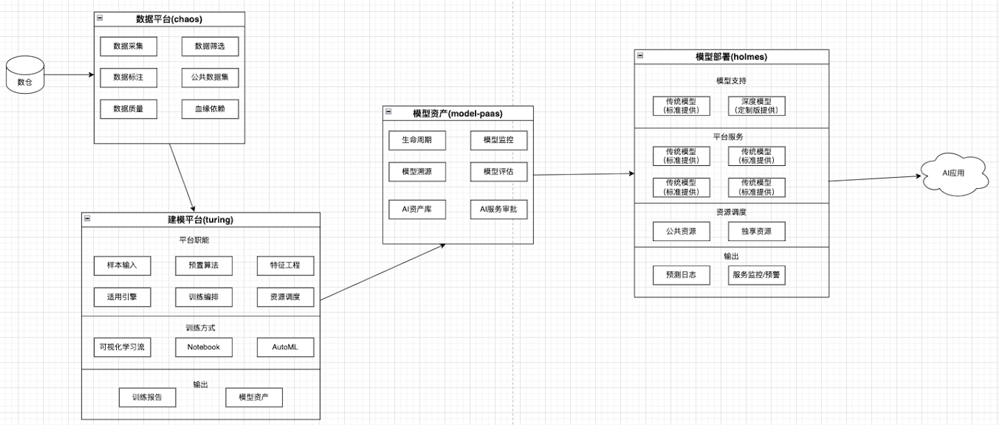

**明模的四大应用**：

- chaos: 数据平台：在整个明模系统中属于中间服务，主要通过从livy提交spark作业，或者操作hive实现业务逻辑。**目前仅处理一些数据的定义，现在提交spark作业，还是各业务系统直接通过livy提交**
- turing: 建模平台：应用服务。可以通过调用jupyter_admin使用notebook开发模型；也可以通过调用xflow，chaos实现可视化建模。
- model-paas: 模型资产：应用服务，核心功能：模型资产管理
  - 模型资产管理：焦点是管理模型生命周期的合规过程
    - 调用fiona实现
- holmes: 模型部署：分为holmes_web, holmes_api, holmes_python.

**注**：新版本中模型监控从模型资产中抽取出来了，丰富了模型监控同时支持业务风险的监控能力。

## 大数据相关概念

- hdfs：分布式文件存储
- hive：分布式数据仓库
- spark：分布式计算框架
- yarn：资源管理组件
- cdh/ark：大数据管理平台
- livy：可通过REST API提交和执行spark作业
- presto：交互即时查询

## 明模模型平台

模型的生命周期：数据准备 -> 模型开发 -> 模型部署 -> 模型运行 -> 模型监控

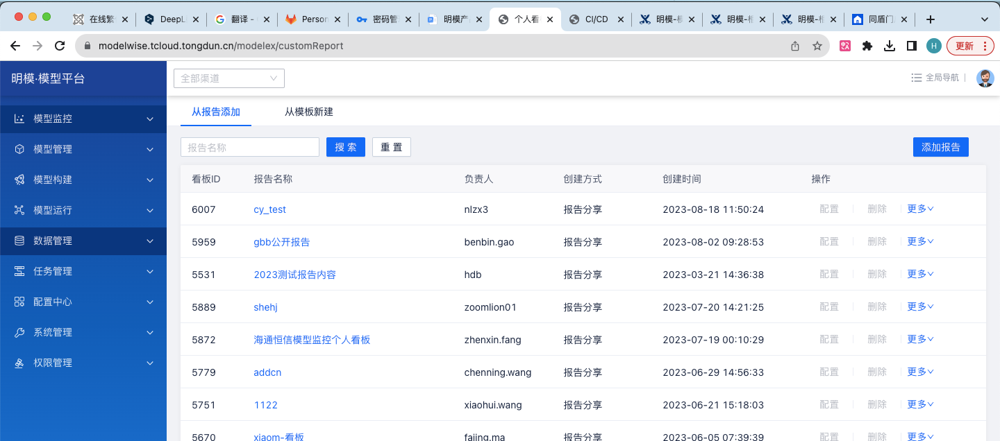

* 模型监控：对应的后台应用：databi
* 模型管理：model-paas
* 模型构建：turing
* 模型运行：holmes
* 数据管理：chaos
* 任务管理：
* 配置中心
* 系统管理
* 权限管理

## question

1. **chaos中有个功能是血缘依赖，什么是血缘依赖？**（目前chaos不具有血缘依赖功能）

   血缘依赖是指数据处理过程中数据之间的依赖关系和数据流向的跟踪记录。

2. **spark与hadoop的区别与联系**

   1. spark是分布式计算框架；hadoop是分布式管理(YARN)、存储(HDFS)、计算(MapReduce)的生态系统；

      spark对标的是hadoop中的MR。但spark的运算速度更快，原因是：

      1. **内存计算**：Spark引入了弹性分布式数据集（RDD）的概念，允许数据在内存中进行高效的计算和缓存。相比之下，Hadoop MapReduce需要将中间结果写入磁盘，而Spark可以在内存中缓存这些中间结果，从而减少了磁盘I/O操作，提高了计算速度。
      2. **数据复用**：Spark允许多个操作在同一份数据上进行多次计算，而无需重新读取和写入数据。这可以减少数据的读取和写入开销，提高了计算效率。在Hadoop MapReduce中，每个阶段都需要从磁盘读取数据，增加了开销
      3. **迭代计算**：对于需要迭代计算的算法，如机器学习和图处理，Spark比Hadoop MapReduce更快。因为Spark可以将中间数据保留在内存中，而MapReduce需要在每个迭代步骤中重新加载数据。

   2. spark可以使用hadoop中的HDFS进行数据存储，也可以通过与YARN集成，使用YARN的资源管理功能来管理集群上的执行器（Executor）资源。

3. **spark中的RDD是什么？**

   **RDD是一种抽象，是Spark对于分布式数据集的抽象，它用于囊括所有内存中和磁盘中的分布式数据实体**

   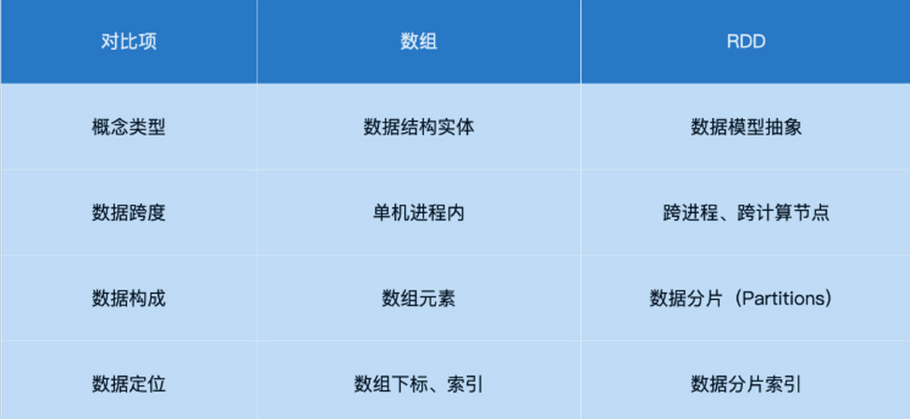

​	**RDD的四大属性**

​		1. partitions: 数据分片;  2partitioner: 分片切割规则;  3. dependencies: RDD依赖;  4.compute: 转换函数

---

4. 模型构建智能建模任务运行成功后就得到了一个具体的模型吗？那这个模型怎么保存的？

   模型构建任务运行成功后，点击报告-保存，可在实验模型中查看

   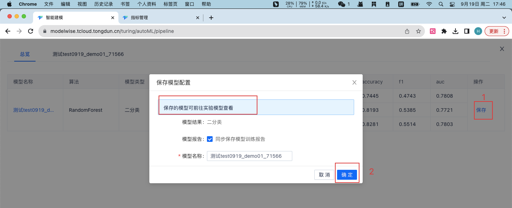

   ---

   

   5. 通过模型构建训练的模型是怎么与我的模型关联的？

   **在我的模型页面，当模型的生命周期处于开放和评估阶段时，可以导入模型。这个导入模型的来源可以选择实验模型和本地文件**

   **模型构建过程**： 

​	在模型构建中通过智能建模任务构建模型，智能建模任务保存成功后保存报告。在实验模型中就可以查看到当前构建的模型。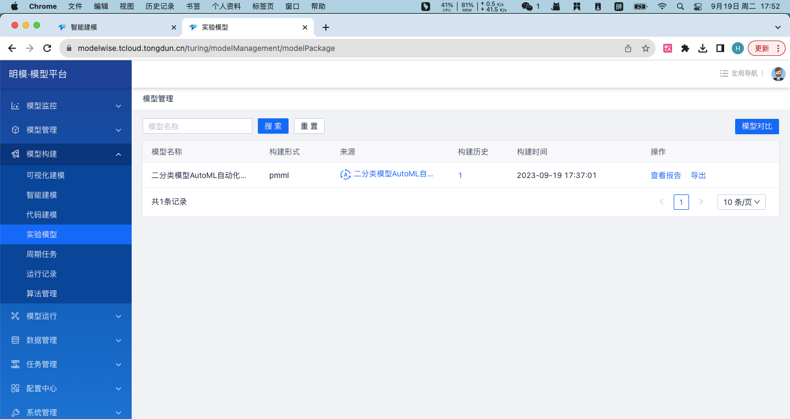

模型管理-我的模型-注册模型,  配置模型需求-提交；并在任务管理中通过。

返回我的模型，点击模型名称进入模型详情页面，导入模型

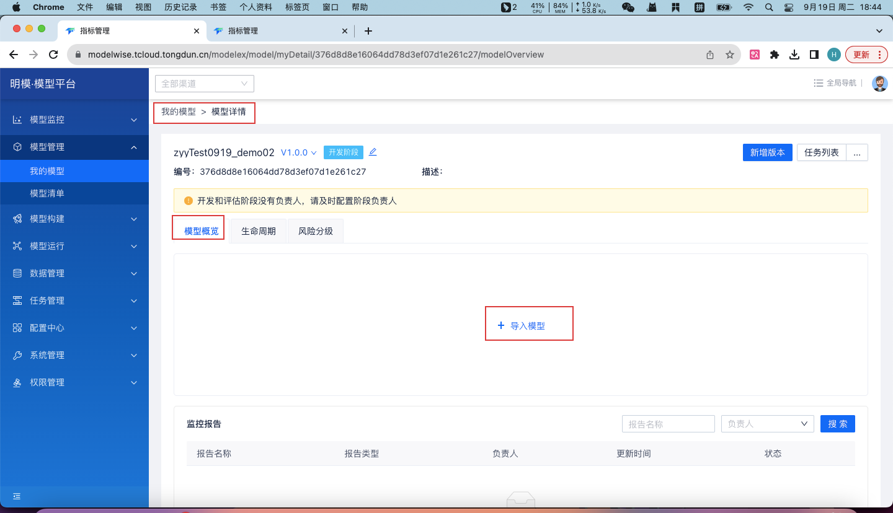

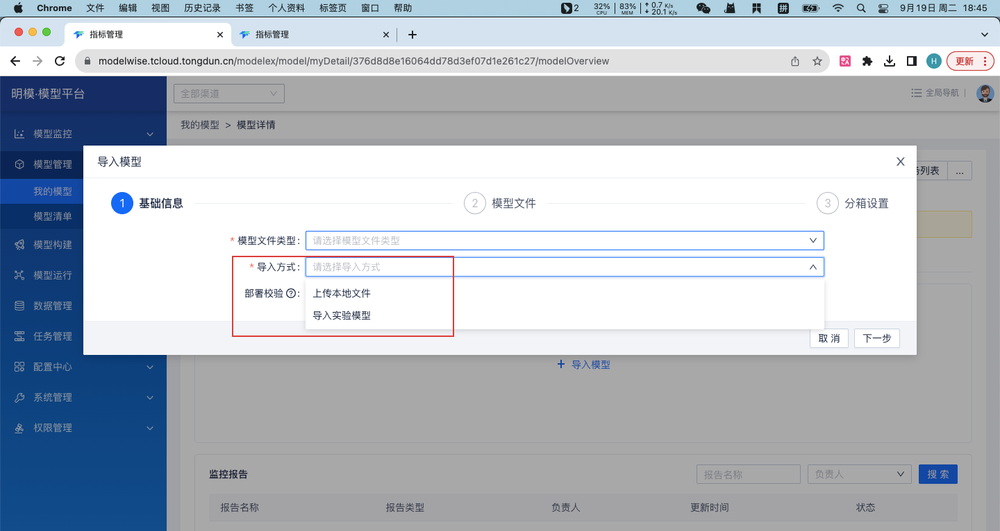

依次完成后续生命周期

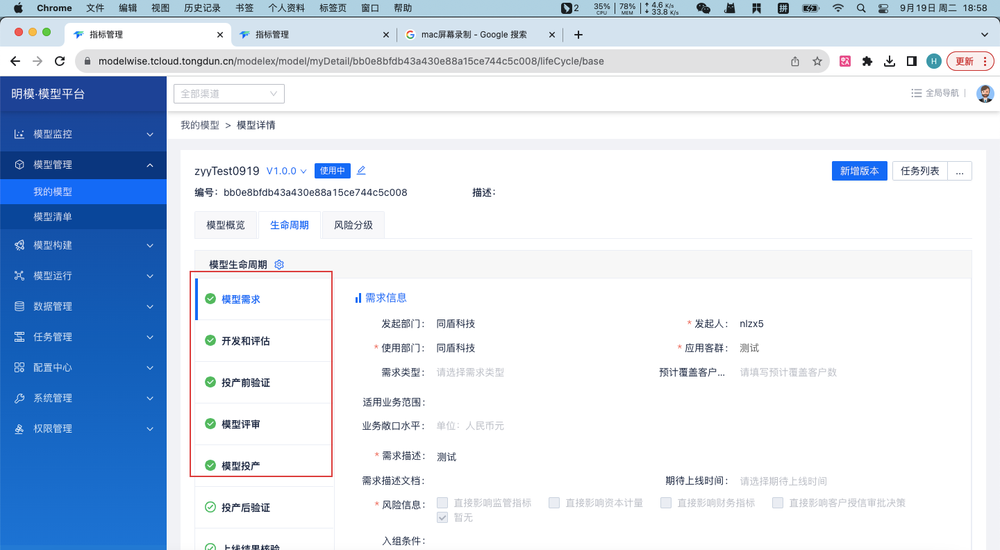

**6.模型处于开发阶段，并成功导入模型，然后将模型回退到需求阶段，为什么导入的模型文件没有被清空**

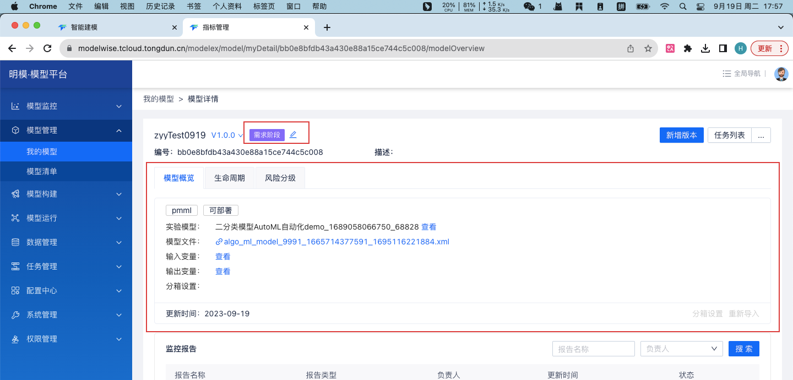

7. 已经配置了负责人，但是页面还是提示负责人不存在。(不影响后续操作)

   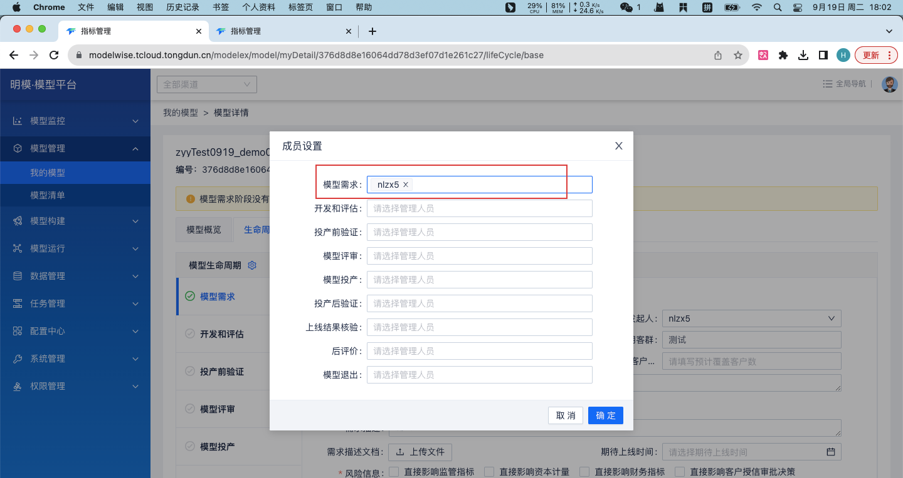

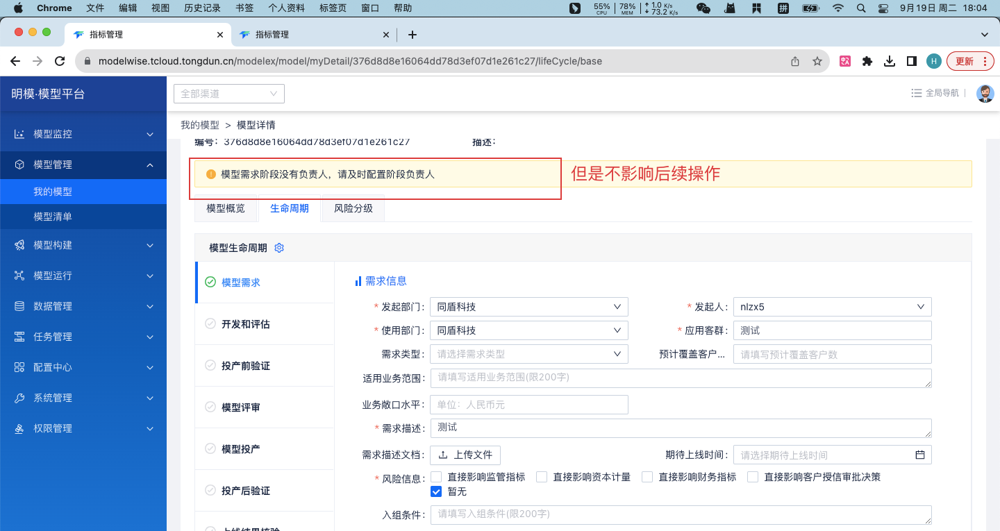

8. 前端页面bug：当处于模型管理-我的模型-模型详情页面，点击任务管理菜单，不会跳转到任务管理菜单页面，而是先展开模型监控页面

   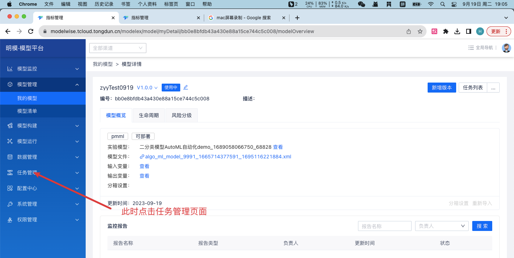

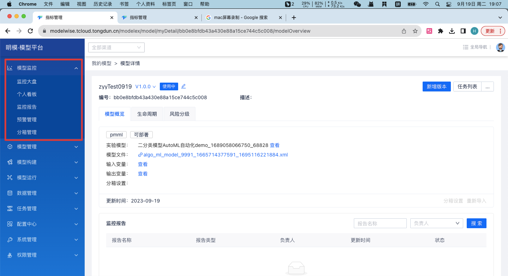